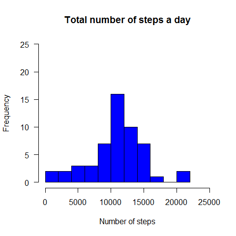
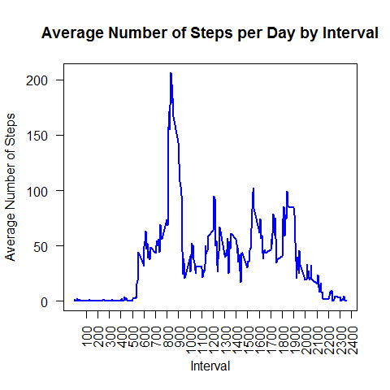
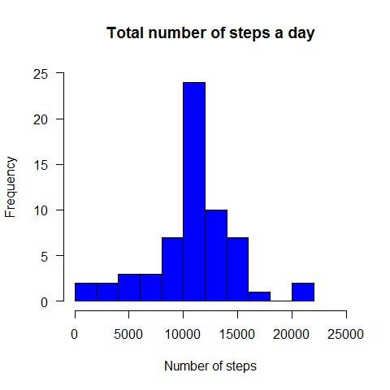
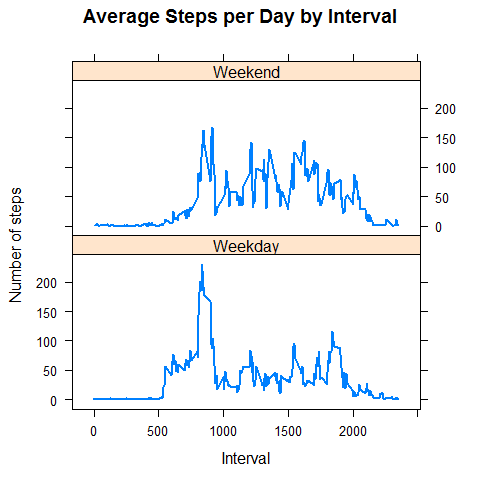

# Reproducible Research: Peer Assessment 1

## Load the data
If required file is not present in our working directory:
* download zip file
* extract it to WD
* delete temp file
* clear memory
* read data


```r
if(!file.exists("activity.csv")) {
        # create temporary file with random name
        temp <- tempfile()
        # download zip archive
        download.file("http://d396qusza40orc.cloudfront.net/repdata%2Fdata%2Factivity.zip", temp)
        # extract it
        unzip(temp)
        # delete temporary file
        unlink(temp)
        # clear memory (delete temp variable)
        rm(temp)
}

# read data
df <- read.csv("activity.csv")
```

## Explore the data
* number, names, types of variables
* number of observations including missing values
* basic stats: mins, maxes, etc
* see some actual data


```r
str(df)
```

```
## 'data.frame':	17568 obs. of  3 variables:
##  $ steps   : int  NA NA NA NA NA NA NA NA NA NA ...
##  $ date    : Factor w/ 61 levels "2012-10-01","2012-10-02",..: 1 1 1 1 1 1 1 1 1 1 ...
##  $ interval: int  0 5 10 15 20 25 30 35 40 45 ...
```

```r
summary(df)
```

```
##      steps                date          interval     
##  Min.   :  0.00   2012-10-01:  288   Min.   :   0.0  
##  1st Qu.:  0.00   2012-10-02:  288   1st Qu.: 588.8  
##  Median :  0.00   2012-10-03:  288   Median :1177.5  
##  Mean   : 37.38   2012-10-04:  288   Mean   :1177.5  
##  3rd Qu.: 12.00   2012-10-05:  288   3rd Qu.:1766.2  
##  Max.   :806.00   2012-10-06:  288   Max.   :2355.0  
##  NA's   :2304     (Other)   :15840
```

```r
head(df)
```

```
##   steps       date interval
## 1    NA 2012-10-01        0
## 2    NA 2012-10-01        5
## 3    NA 2012-10-01       10
## 4    NA 2012-10-01       15
## 5    NA 2012-10-01       20
## 6    NA 2012-10-01       25
```

```r
tail(df)
```

```
##       steps       date interval
## 17563    NA 2012-11-30     2330
## 17564    NA 2012-11-30     2335
## 17565    NA 2012-11-30     2340
## 17566    NA 2012-11-30     2345
## 17567    NA 2012-11-30     2350
## 17568    NA 2012-11-30     2355
```

## Preprocess the data
* convert 'date' variable to correct class (Factor -> Date)


```r
df$date <- as.Date(df$date, "%Y-%m-%d")
```

## What is mean total number of steps taken per day?
* calculate total number of steps per day
* create histogram


```r
# calculate total number of steps per day
steps <- aggregate(steps ~ date, df, sum)

# create histogram
hist(steps$steps,
     col = "blue",
     yaxt = "n",
     breaks = 10,
     xlab = "Number of steps",
     xlim = c(0, 25000),
     ylim = c(0, 25), 
     main = "Total number of steps a day")

# turn labels on y-axis to be more readable
axis(2, las = 2)
```

 

* calculate **mean** and **median** of the number of steps

```r
mean(steps$steps)
```

```
## [1] 10766.19
```

```r
median(steps$steps)
```

```
## [1] 10765
```

Mean  : 1.0766189\times 10^{4}
Median: 10765

## What is the average daily activity pattern?

* make a time series plot of the 5-minute interval (x-axis) and the average number of steps taken, averaged across all days (y-axis)


```r
# average number of steps for each interval for all days
interval <- aggregate(steps ~ interval, df, mean)

# plot the average number of steps per day by interval
plot(interval$interval, interval$steps,
     lwd  = 2,
     xaxt = "n",
     yaxt = "n",
     type = "l",
     col  = "blue",
     xlab = "Interval",
     ylab = "Average Number of Steps",
     main = "Average Number of Steps per Day by Interval")
axis(1, at = seq(100, 2500, by = 100), las = 2)
axis(2, las = 2)
```

 

* find 5-minute interval that contains the maximum of steps, on average across all days


```r
max <- interval[which.max(interval$steps),]
max
```

```
##     interval    steps
## 104      835 206.1698
```

Interval number 835 contains maximum number of steps - 206

## Imputing missing values

Note that there are a number of days/intervals where there are missing values (coded as NA).
The presence of missing days may introduce bias into some calculations or summaries of the data.

1. Calculate and report the total number of missing values in the dataset

```r
sum(is.na(df))
```

```
## [1] 2304
```

The number of NA's is **2304**.

2. Devise a strategy for filling in all of the missing values in the dataset
NA values will be replaced by the mean number of steps per identical 5-minute interval (calculated earlier)

3. Create a new dataset with the missing data filled in

```r
# replace NA values by the mean number of steps per identical 5-minute interval
for (i in 1:nrow(df)) {
    if(is.na(df$steps[i]))
        df$steps[i] <- interval$steps[interval$interval == df$interval[i]]
}
```

4. Make a histogram of the total number of steps taken each day and calculate and report the mean and median total number of steps taken per day. Do these values differ from the estimates from the first part of the assignment?
What is the impact of imputing missing data on the estimates of the total daily number of steps?

```r
# calculate updated total number of steps 
steps.new <- aggregate(steps ~ date, df, sum)

# build histogram
hist(steps.new$steps,
     col = "blue",
     breaks = 10,
     yaxt = "n",
     xlab = "Number of steps",
     xlim = c(0, 25000),
     ylim = c(0, 25), 
     main = "Total number of steps a day")
axis(2, las = 2)
```

 

```r
# calculate new mean and median values
mean(steps.new$steps)
```

```
## [1] 10766.19
```

```r
median(steps.new$steps)
```

```
## [1] 10766.19
```

* Updated data mean  : 1.0766189\times 10^{4}
* Updated data median: 1.0766189\times 10^{4}

Do these values differ from the estimates from the first part of the assignment?
Yes, they differ slightly.

Before imputing                 | After imputing
--------------------------------|------------------------------------
Mean  : 1.0766189\times 10^{4}   | Mean  : 1.0766189\times 10^{4}
Median: 10765 | Median: 1.0766189\times 10^{4}

Mean and median after imputing the data are equal.

What is the impact of imputing missing data on the estimates of the total daily number of steps?
Median value has changed (slightly increased) and equals to the mean.

## Are there differences in activity patterns between weekdays and weekends?
* Create a new factor variable in the dataset with two levels: weekday<U+0094> and <U+0093>weekend
* Build plot to compare


```r
# find day of week from the date
day  <- weekdays(df$date)

# create new variable
type <- vector()

# determine day of week for every observation
for (i in 1:nrow(df)) {
    if (day[i] == "Saturday" || day[i] == "Sunday") {
        type[i] <- "Weekend"
    } else {
        type[i] <- "Weekday"
    }
}

# add new variable to the dataset
df$type <- as.factor(type)

# calculate means groupped by day of week type
compare <- aggregate(steps ~ interval + type, data = df, mean)

# connect required library
library("lattice")

# plot the data
xyplot(steps ~ interval | type,
       data = compare,
       lwd=2,
       type = "l",
       layout = c(1, 2),
       xlab = "Interval",
       ylab = "Number of steps",
       main = "Average Steps per Day by Interval")
```

 

# Conclusion
As we can see weekdays are more active in the earlier time (closer to the left edge of the graph) and then averaging through the course of the day with higher peaks closer to evening times (right part of the graph). Weekends activities start in later times and with higher peaks throught the daytime meaning more activity overall. Current pattern may belong to an office worker.
